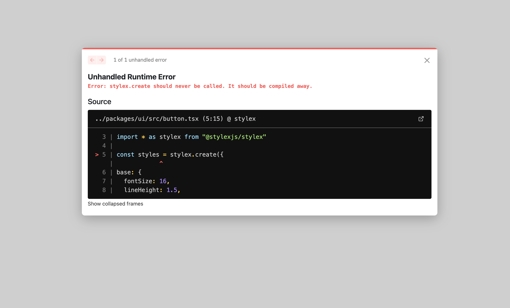
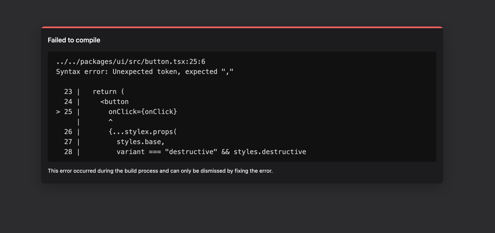

# StyleX Issue

This repository showcases the issue discussed [here](https://github.com/facebook/stylex/issues/63)

## Project

`/apps/docs` is a simple NextJS application (with app router). It has [@repo/ui](./packages/ui) as a dependency which imports the Typescript directly.

`/packages/ui` is a StyleX component library package

## Setup & Run

1. `pnpm i`
2. `pnpm dev`
3. Visit `http://localhost:3001` and you will see:

4. Add all the `@stylex/...` eslint/babel configurations
5. Re-run and see:

